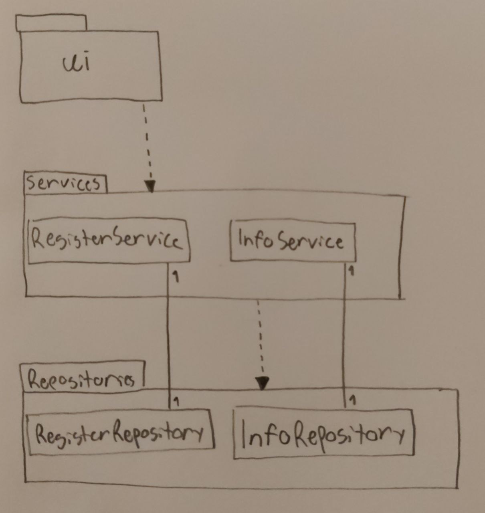

# Arkkitehtuurikuvaus

## Rakenne

Ohjelman rakennetta kuvaava luokka/pakkauskaavio:

Pakkaus _ui_ sisältää käyttöliittymästä vastaavan koodin. Pakkauksen _Services_ luokat sisältävät sovelluslogiikasta vastaavan koodin ja pakkauksen _Repositories_ luokat tietojen pysyväistallennuksesta vastaavan koodin.

## Käyttöliittymä

Käyttöliittymä on toteutettu tekstikäyttöliittymänä, jota voi käyttää komentoriviltä. Käyttöliittymässä on erilaisia näkymiä, josta tärkeimmät ovat:

- Kirjautuminen/uuden käyttäjän luominen
- Kirjautuneen käyttäjän toiminnot
- Adminin toiminnot

Näissä näkymissä pystyy tehdä erilaisia komentoja, jotka vievät uuteen näkymään tai palaavat edelliseen. 

## Sovelluslogiikka

Luokka `InfoService` vastaa jäsenyyden uusimisohjeiden muokkaamisesta ja näyttämisestä. Luokka `RegisterService` vastaa muista määrittelydokumentin toiminnallisuuksista sovelluslogiikan tasolla. Luokat tarjoavat kaikille käyttöliittymän toiminnoille oman metodin.

## Tietojen pysyväistallennus

Luokka `InfoRepository` vastaa jäsenyyden uusimisohjeiden tallentamisesta tekstitiedostoon. Luokka `RegisterRepository` puolestaan hoitaa käyttäjien tietojen tallentamisesta tietokantaan. 

### Tiedostot

Juurihakemistosta löytyvä _.env_-tiedosto määrittelee tietokannan ja tekstitiedoston nimet. Testatessa käytetään _.env.test_-tiedoston määrittelemiä tiedostonimiä, jolloin testit eivät sekoita varsinaisten tiedostojen sisältöä.

Tietokanta alustetaan _initialize_database.py_-tiedostossa. Tietokantaan tallennetaan käyttäjien käyttäjänimi, salasana, nimi, sähköposti, puhelinnumero, jäsenyyden päättymispäivä sekä tieto siitä, onko käyttäjä admin vai ei (1 = admin, 0 = ei admin). Sarakkeissa sähköposti, puhelinnumero ja jäsenyyden päättymispäivä voi olla myös None-olio.
