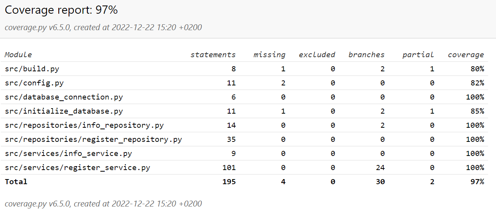

# Testausdokumentti

Ohjelmaa on testattu sekä unittestillä että manuaalisesti.

## Yksikkö- ja integraatiotestaus

Sovelluslogiikasta vastaavia luokkia `RegisterService` ja `InfoService` sekä repository-luokkia `RegisterRepository` ja `InfoRepository` luokkia testataan ainoastaan testien käytössä olevilla tiedostoilla, joiden nimet löytyvät _.env.test_-tiedostosta. `TestRegisterService`-luokka vastaa `RegisterService`-luokan testaamisesta, `TestInfoService`-luokka vastaa `InfoService`-luokan testaamisesta, `TestRegisterRepository`-luokka vastaa `RegisterRepository`-luokan testaamisesta ja `TestInfoRepository`-luokka vastaa `InfoRepository`-luokan testaamisesta.

### Testauskattavuus

Käyttöliittymäkerrosta lukuunottamatta sovelluksen testauksen haarautumakattavuus on 97%

Testaamatta jäivät tiedostojen _build.py_ ja _initialize_database.py_ suorittaminen komentoriviltä sekä _config.py_-tiedostosta tapaus, jossa load_dotenv()-funktio tuottaa FileNotFound -virheen.

## Järjestelmätestaus

Kaikki määrittelydokumentin toiminnallisuudet on testattu manuaalisesti.
